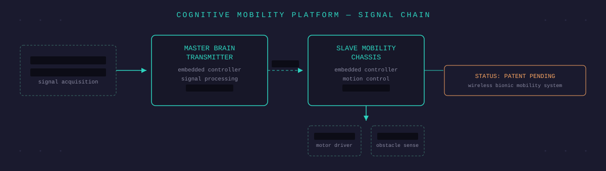
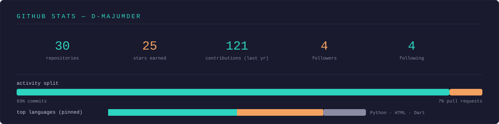

<div align="center">



<br/><br/>


</div>

<p align="center">
  
  
  
</p>

---

### `> whoami`

```yaml
name: Dhruba Majumder
role: BCA student (4th year) · builder · founder
currently_building: Cognitive Mobility Platform (CMP)
  desc: >
    A wireless bionic wheelchair, steered by the body's own signals —
    ▓▓▓ / ▓▓▓ / ▓▓▓ [REDACTED] — read by a Master Brain Transmitter
    and relayed over ▓▓▓▓▓▓▓▓▓ [CLASSIFIED] to a Slave Mobility Chassis.
  status: patent pending
also_running: Hastavya
  desc: >
    A handcrafted goods brand reviving traditional clay art and
    heritage craft from Krishnanagar — trade-licensed, live on Meesho.
also_managing: Abhay Charan Art Academy
  desc: >
    Social media, website build & upkeep, database & student records.
next_build: Bionic arm, brain-signal controlled
  desc: exploring new control methods — early stage
side_skill: beginner laptop / PC hardware repair
interests: [blockchain, computer vision, embedded systems, robotics, post-production audio/video]
```

---

### `> system.modules --list`

| Channel | Module | Status |
|---|---|---|
| `▓▓▓/▓▓▓/▓▓▓` | [REDACTED] signal acquisition | 🟢 calibrated |
| `▓▓-LINK` | [CLASSIFIED] Master ↔ Slave handshake | 🟢 synced |
| `MOTOR` | [REDACTED] driver · per-motor trim | 🟢 tuned |
| `SENSOR` | [REDACTED] obstacle avoidance | 🟢 polling |
| `POWER` | Dual-cell battery pack | 🟢 nominal |
| `IP_STATUS` | CMP — patent pending | 🟡 filing in progress |
| `ROBOTICS_NEXT` | Bionic arm, brain-signal controlled | 🔵 early stage |
| `ACAA` | Abhay Charan Art Academy — socials, website, DB, student records | 🟢 live |
| `HASTAVYA` | Heritage clay craft, live commerce | 🟢 shipping |
| `HW_REPAIR` | Laptop / PC hardware repair | 🟡 learning |

---

### `> stack.probe()`

<p align="center">
  
</p>

---

### `> stats.fetch --self`

<p align="center">
  
</p>

---

### `> log.tail -f`

```diff
+ [OK] Firmware ▓▓▓▓▓▓▓▓▓▓▓ resolved — non-blocking poll active
+ [OK] Presentation deck redesigned — sage-mist visual identity
+ [OK] Thermocol scale model complete — ready for science fair floor
! [INFO] Next milestone: closed-loop calibration pass on Slave Chassis
```

---

<p align="center">
  <em>Two hands, two disciplines — one wired for signals, one shaped in clay.</em>
</p>

<p align="center">
  <a href="https://www.linkedin.com/in/iamdhrubamajumder/"></a>
</p>
